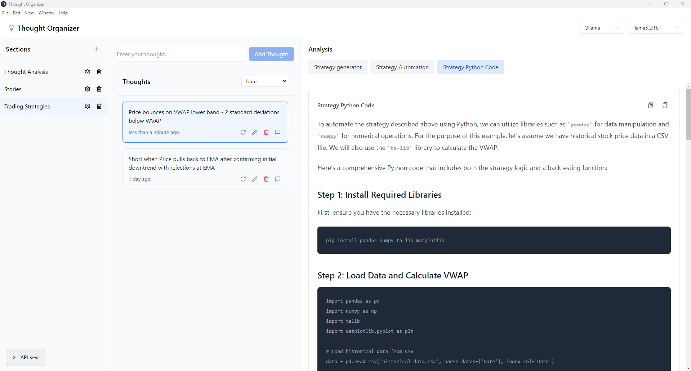

# Thought Organizer

## Overview

Thought Organizer is an innovative AI-powered application designed to help entrepreneurs, innovators, and creative professionals transform raw ideas into structured, actionable insights. By leveraging advanced AI technologies, this tool provides comprehensive analysis and enhancement of your thoughts.



## Features

- **Intelligent Idea Analysis**
  - AI-powered enhancement of thought content
  - Market research generation
  - Business case evaluation

- **Ranking System**
  - Market Impact Assessment
  - Viability Scoring
  - Comprehensive Thought Ranking

- **Interactive AI Chat**
  - Context-aware conversation with AI
  - Iterative idea refinement
  - Error handling and graceful communication

- **Workflow Customization**
  - Define custom analysis steps
  - Choose AI models per step
  - Use previous step results as context

- **Flexible AI Integration**
  - OpenAI integration (requires API key)
  - Perplexity AI integration (requires API key)
  - Local Ollama integration (no API key required)
  - Easy API key management through UI

## Technology Stack

- **Frontend**: React with TypeScript
- **State Management**: Zustand
- **UI Components**: Tailwind CSS, Ant Design
- **AI Integration**: OpenAI, Perplexity AI, Ollama
- **Backend**: Electron, Express
- **Storage**: Local file system with optional Supabase integration

## Getting Started

### For Users

The application is available as a desktop app for Windows and Mac. Visit our [website](https://mukkarapavankumar.github.io/Thought-organizer-v2/) for:
- Download links for the latest release
- Installation instructions
- User guide

After installing:
1. Launch the application
2. Click the API Keys section in the bottom left
3. (Optional) Enter your OpenAI and/or Perplexity API keys
4. Start organizing your thoughts!

Note: The app works with Ollama by default if no API keys are provided.

### For Developers

#### Prerequisites

- Node.js (v18+)
- npm or yarn
- OpenAI API Key (optional)
- Perplexity API Key (optional)

#### Installation

1. Clone the repository
   ```bash
   git clone https://github.com/mukkarapavankumar/thought-organizer-v2.git
   cd thought-organizer-v2
   ```

2. Install dependencies
   ```bash
   npm install
   ```

#### Development Mode

1. Start the development server:
   ```bash
   npm run dev
   ```

2. In another terminal, start the Electron app:
   ```bash
   npm run electron:dev
   ```

#### Building

1. Build the application:
   ```bash
   npm run build
   npm run electron:build
   ```

The built application will be in the `release` folder.

## Configuration

- Modify AI providers in `src/services/ai/config.ts`
- Customize UI in Tailwind configuration
- Adjust thought analysis parameters in respective service files

## Recent Updates

- Added support for custom workflows with multiple steps
- Implemented model selection per workflow step
- Added context passing between workflow steps
- Migrated to local file system storage
- Added Electron desktop app packaging
- Improved markdown rendering in analysis panel
- Enhanced UI layout and responsiveness
- Added copy functionality for code blocks
- Added in-app API key management

## Contributing

1. Fork the repository
2. Create your feature branch (`git checkout -b feature/AmazingFeature`)
3. Commit your changes (`git commit -m 'Add some AmazingFeature'`)
4. Push to the branch (`git push origin feature/AmazingFeature`)
5. Open a Pull Request

## License

Distributed under the MIT License. See `LICENSE` for more information.

## Contact

Pavan Kumar Mukkara - [LinkedIn](https://www.linkedin.com/in/pavan-kumar-srinivas-12947154/)

Project Link: [https://github.com/mukkarapavankumar/thought-organizer-v2](https://github.com/mukkarapavankumar/thought-organizer-v2)

---

**Note**: The compiled application is not included in this repository. Please visit our [website](https://mukkarapavankumar.github.io/Thought-organizer-v2/) to download the latest release.